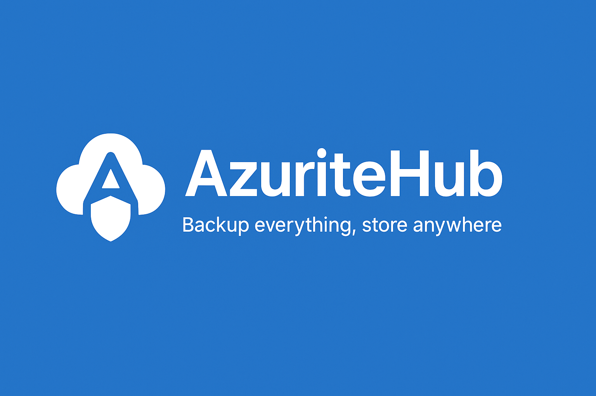

# AzuriteHub
> **Backup everything, store anywhere** – The open-source multi-cloud backup platform.

**AzuriteHub** is a lightweight, open-source backup solution for databases, files, and cloud resources.  
It supports **multi-database engines** (SQL Server, MySQL, PostgreSQL) and **multi-cloud storage** (Google Drive, AWS S3, Azure Blob, Dropbox) with **automatic scheduling, compression, and notifications**.  
Perfect for developers, sysadmins, and small teams who want **reliable, extensible, and easy-to-use backups**.



[](LICENSE)
[](https://github.com/AzuriteHub/AzuriteHub/stargazers)
[](https://github.com/AzuriteHub/AzuriteHub/actions)

---
## What is AzuriteHub?

**AzuriteHub** is an **open-source backup tool** designed for **databases, files, and cloud resources**.  
It supports **multi-cloud destinations** and **multiple database engines**, with **automatic scheduling, compression, and notifications**.

With AzuriteHub, you can:
- Backup **SQL Server, MySQL, PostgreSQL** (more coming soon).
- Store backups in **Google Drive, AWS S3, Azure Blob, Dropbox**.
- Automate backups with **cron-style schedules**.
- Compress backups to save space.
- Receive email notifications after successful or failed backups.
- Keep a full history of backups.
---
## Features

- **Multi-database support**
  - SQL Server, MySQL, PostgreSQL
  - Extensible to other DB engines via plugins
- **Multi-cloud storage**
  - Google Drive, AWS S3, Azure Blob, Dropbox, Local
- **Scheduling**
  - Cron-based scheduling (powered by Quartz.NET)
- **Compression**
  - Automatic ZIP/GZIP compression
- **Notifications**
  - Email, Slack, Telegram (configurable)
- **Backup history**
  - View and manage past backups
- **Modular architecture**
  - Built with Domain-Driven Design (DDD) for easy extension

---

## Tech Stack

- **.NET 9** (C#)
- **Quartz.NET** for scheduling
- **Google.Apis.Drive.v3** for Google Drive integration
- **System.IO.Compression** for file compression
- **Serilog** for logging
- **Entity Framework Core** (SQLite for history storage)

---
## Installation

```bash
# Clone the repository
git clone https://github.com/steve-bang/AzuriteHub.git
cd AzuriteHub

# Build the project
dotnet build

# Run
dotnet run --project BackupDb.Cli
```

## Quick Start

## Documentation

### Scheduled Jobs
This project includes a scheduled job `DatabaseBackupPipelineJob` that runs every Sunday at midnight. For details and instructions on how to modify the schedule, see [docs/scheduled-jobs.md](docs/scheduled-jobs.md).

## Contributing

We welcome contributions from the community!
Here’s how you can help:

- Report bugs
- Suggest features
- Submit pull requests
- Improve documentation
- See our CONTRIBUTING.md for details.

## Community & Support

💬 GitHub Discussions – ask questions & share ideas

🐦 Twitter: @AzuriteHub

📧 Email: support@azuritehub.io

## License

This project is licensed under the MIT License – see the LICENSE file for details.

## Star us on GitHub!

If you find AzuriteHub useful, please give it a ⭐ on GitHub to help more people discover it!
Your support is the best motivation for us to keep improving.
